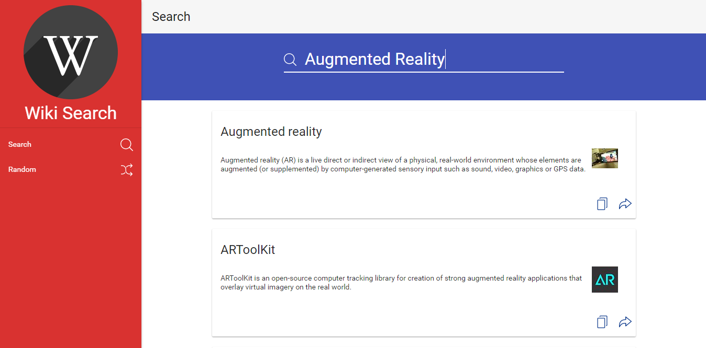

# Wiki Search

This project provides a simple and easy to use **Wikipedia** application.

This application can be used to search Wikipedia's articles and read them quickly. You can also read a random article from Wikipedia.

>Demo: http://purush0th.github.io/wiki-search
 
 _This project is entirely built on Angular Material. visit here https://material.angularjs.org/latest_
 
### Search an article
<br/>

<br/>

### Read an article
<br/>

<br/>

### Read a random article
<br/>

<br/>

### Get more random article
<br/>

<br/>


### Running the App

You can install http-server globally:

```
npm install -g serve
```

Then you can start your own development web server to serve static files from a folder by running:

>Move to the `src` folder.</br>
>Run `serve` in a Terminal window</br>
>Open browser to url `http://localhost:3000`

### Contribution
You are welcome to create an issue, suggesting a cool idea to improve this project or fork this repo.
